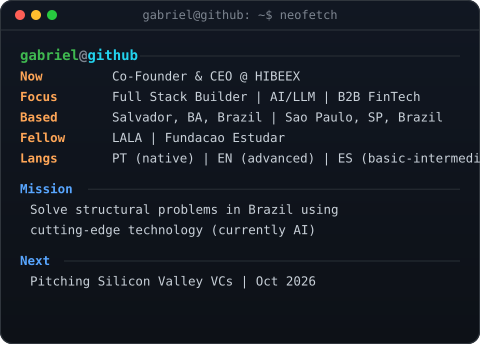
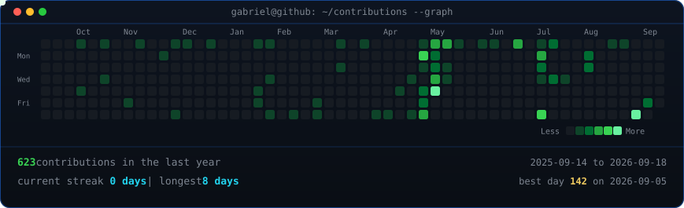

<table>
<tr>
<td valign="top"></td>
<td valign="top"></td>
</tr>
</table>

## Gabriel Moreno Ribeiro

**Co-Founder & CEO @ HIBEEX · Full Stack Builder · B2B FinTech**

 

 

 

**Languages**

<b>32 things I wrote from scratch, in 30 languages</b> (one per chapter of build-your-own-x, all with tests and CI)

 

| | | |
| --- | --- | --- |
| [pygrep](https://github.com/gabriel-moreno-ribeiro/pygrep) · Python · grep | [stencil](https://github.com/gabriel-moreno-ribeiro/stencil) · Perl · template engine | [rubyeliza](https://github.com/gabriel-moreno-ribeiro/rubyeliza) · Ruby · ELIZA + Telegram |
| [luaregex](https://github.com/gabriel-moreno-ribeiro/luaregex) · Lua · regex engine | [phpsearch](https://github.com/gabriel-moreno-ribeiro/phpsearch) · PHP · search engine | [sprout](https://github.com/gabriel-moreno-ribeiro/sprout) · TypeScript · mini React + Chrome ext |
| [voxelgl](https://github.com/gabriel-moreno-ribeiro/voxelgl) · JavaScript · voxel engine | [dartris](https://github.com/gabriel-moreno-ribeiro/dartris) · Dart · Tetris | [gosh](https://github.com/gabriel-moreno-ribeiro/gosh) · Go · POSIX shell |
| [jhttpd](https://github.com/gabriel-moreno-ribeiro/jhttpd) · Java · HTTP/1.1 server | [gitsharp](https://github.com/gabriel-moreno-ribeiro/gitsharp) · C# · Git | [cljchain](https://github.com/gabriel-moreno-ribeiro/cljchain) · Clojure · blockchain |
| [swiftsql](https://github.com/gabriel-moreno-ribeiro/swiftsql) · Swift · SQL database | [exraft](https://github.com/gabriel-moreno-ribeiro/exraft) · Elixir · Raft | [lumen](https://github.com/gabriel-moreno-ribeiro/lumen) · OCaml · programming language |
| [juliann](https://github.com/gabriel-moreno-ribeiro/juliann) · Julia · neural nets | [nimphys](https://github.com/gabriel-moreno-ribeiro/nimphys) · Nim · 2D physics | [tedit](https://github.com/gabriel-moreno-ribeiro/tedit) · C · text editor |
| [chip8](https://github.com/gabriel-moreno-ribeiro/chip8) · C++ · CHIP-8 emulator | [zigtracer](https://github.com/gabriel-moreno-ribeiro/zigtracer) · Zig · path tracer | [asmalloc](https://github.com/gabriel-moreno-ribeiro/asmalloc) · x86-64 asm · malloc |
| [hstorrent](https://github.com/gabriel-moreno-ribeiro/hstorrent) · Haskell · BitTorrent | [rustnet](https://github.com/gabriel-moreno-ribeiro/rustnet) · Rust · TCP/IP stack | [kotbrowse](https://github.com/gabriel-moreno-ribeiro/kotbrowse) · Kotlin · browser engine |
| [rvision](https://github.com/gabriel-moreno-ribeiro/rvision) · R · visual recognition | [vcpu](https://github.com/gabriel-moreno-ribeiro/vcpu) · Verilog · RISC-V CPU | [scalar](https://github.com/gabriel-moreno-ribeiro/scalar) · Scala · augmented reality |
| [fsgpt](https://github.com/gabriel-moreno-ribeiro/fsgpt) · F# · GPT + autograd | [nanos](https://github.com/gabriel-moreno-ribeiro/nanos) · asm + C · x86 OS | [erdis](https://github.com/gabriel-moreno-ribeiro/erdis) · Erlang · Redis |
| [hindi2pt](https://github.com/gabriel-moreno-ribeiro/hindi2pt) · Python · Hindi → pt-BR subtitles | [merlita-tracker](https://github.com/gabriel-moreno-ribeiro/merlita-tracker) · ESP32 + Pi · my pig's escape detector | |

**Frontend**

**Backend & Databases**

**Cloud, DevOps & Tooling**

 

 

 

 

 

 

### Connect

 

*Ship fast · Measure impact · Iterate relentlessly*

